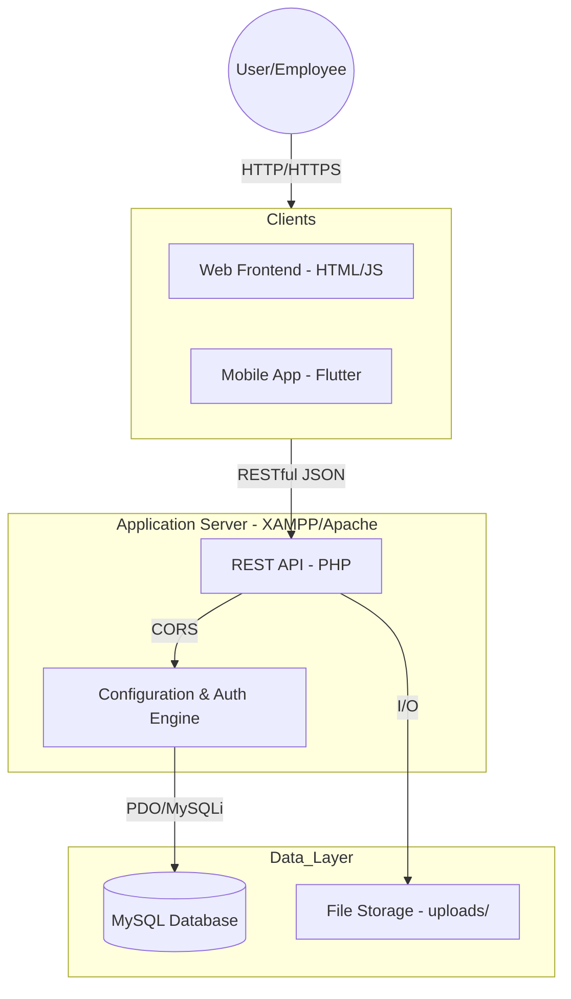

# System Architecture - FinSight

FinSight is designed as a multi-tier application providing financial management through a web interface, a mobile application, and a centralized RESTful API.

## 🏗 High-Level Architecture

---

## 💻 Components

### 1. REST API (Backend)
-   **Technology:** PHP 8.x
-   **Location:** `/backend/api`
-   **Role:** Handles all business logic, data persistence, and security.
-   **Key Services:**
    -   `AuthMiddleware.php`: Handles token validation and RBAC.
    -   `Database.php`: Centralized database connection and utility class.
    -   `MailService.php`: Handles notification and password reset emails.

### 2. Web Frontend
-   **Technology:** HTML5, Vanilla JavaScript, CSS3
-   **Location:** `/frontend`
-   **Role:** Provides a desktop-optimized interface for deep accounting tasks like report generation and user management.

### 3. Mobile Application
-   **Technology:** Flutter (Dart)
-   **Location:** `/mobile`
-   **Role:** Optimized for on-the-go voucher creation, dashboard viewing, and notifications.

---

## 🗄 Database Design

The database (`finsight_db`) is designed around standard double-entry bookkeeping principles.

### Core Tables

| Table              | Description                                                                 |
| ------------------ | --------------------------------------------------------------------------- |
| `users`            | Stores user credentials, roles (`admin`, `manager`, `accountant`), and profile info. |
| `account_chart`    | The Chart of Accounts (COA). Stores Assets, Liabilities, Equity, Income, and Expenses. |
| `vouchers`         | Header information for financial transactions (Draft, Posted, Rejected).    |
| `voucher_details`  | Specific debit/credit line items associated with a voucher.                 |
| `general_ledger`   | Finalized ledger entries used for generating Balance Sheets and P&L reports. |
| `audit_trail`      | Logs every sensitive action (login, modifications) for security compliance. |
| `fiscal_periods`   | Defines financial year segments and closure status.                         |

---

## 🔐 Security & Authentication

1.  **JWT-like Token Auth:** Users receive a session token upon successful login.
2.  **RBAC (Role-Based Access Control):**
    -   `Admin`: Full system access, user management, and configuration.
    -   `Manager`: Approval power for vouchers and report viewing.
    -   `Accountant`: Data entry, voucher creation, and basic reporting.
3.  **Audit Logging:** Every transaction and user action is logged in the `audit_trail` table with IP and User-Agent details.
4.  **Google OAuth:** Optional OAuth2 integration for streamlined login.
